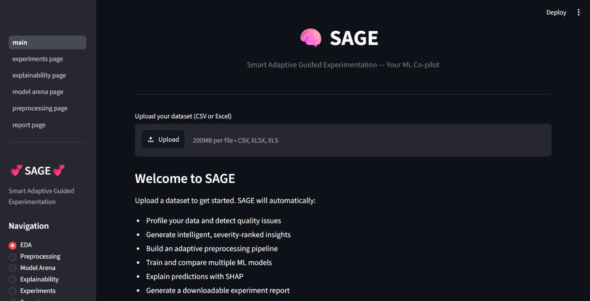
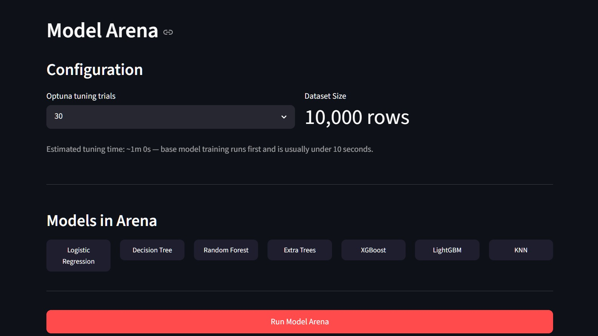
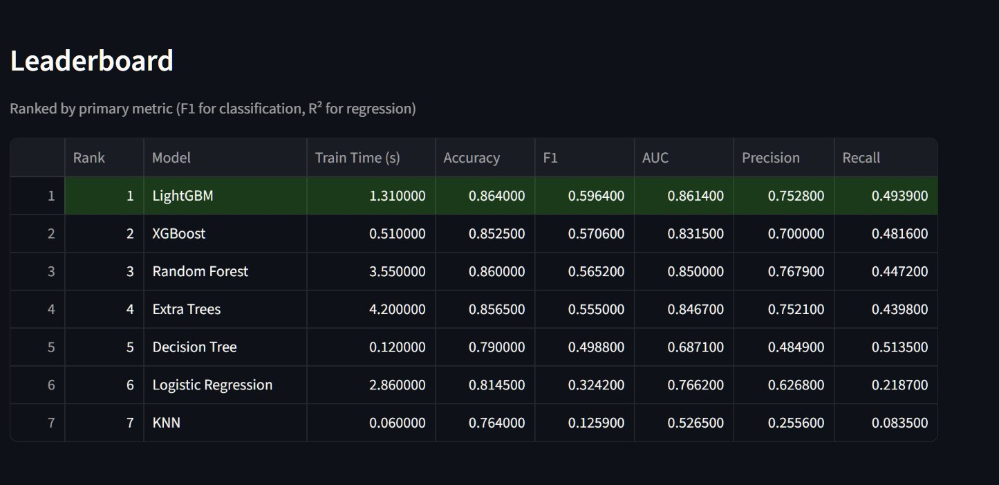
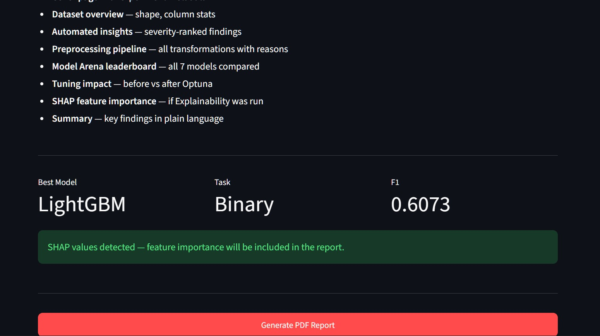

# 🧠 SAGE — Smart Adaptive Guided Experimentation

[](https://python.org)
[](https://streamlit.io)
[](https://lightgbm.readthedocs.io)
[](https://xgboost.readthedocs.io)
[](https://shap.readthedocs.io)
[](https://optuna.org)
[](LICENSE)

> **Your end-to-end ML co-pilot.** Upload a dataset, SAGE handles everything else — profiling, preprocessing, model training, explainability, and a professional PDF report. Zero cost, zero hardcoding.

🚀 **Live Demo:** [huggingface.co/spaces/akshatkh18/SAGE](https://huggingface.co/spaces/akshatkh18/SAGE) *(coming soon)*

---

## 🤔 Why SAGE?

Most AutoML tools are black boxes. They automate the pipeline but never tell you *why* they made each decision.

SAGE is different:
- Every preprocessing step comes with a **human-readable justification**
- The insight engine detects data quality issues with **severity levels** (critical / warning / info)
- SHAP explainability translates model decisions into **plain English**
- Every experiment is **logged to SQLite** so you can compare runs over time
- The final output is a **professional PDF report** you can share with anyone

- ---

## ⚙️ Features

| Module | What it does |
|--------|-------------|
| 🔍 **EDA** | Auto-profiles your dataset — missing values, skew, outliers, correlations, data quality insights |
| 🧹 **Preprocessing** | Adaptive pipeline — imputation, encoding, winsorizing, datetime extraction, ID detection |
| 🏟️ **Model Arena** | Trains 7 models, ranks by F1/R², runs Optuna tuning on the winner |
| 💡 **Explainability** | SHAP summary, bar, and waterfall plots + natural language explanations |
| 🗃️ **Experiment Memory** | SQLite logging — compare every run you've ever done |
| 📄 **PDF Report** | Professional 7-page report with charts, tables, and plain-language summary |

---

## 🧠 Models in the Arena

- Logistic Regression
- Decision Tree
- Random Forest
- Extra Trees
- XGBoost
- LightGBM
- KNN

Winner gets Optuna hyperparameter tuning (10–50 trials, auto-scaled to dataset size).

---

## 🛠️ Tech Stack

- **UI:** Streamlit
- **ML:** scikit-learn, XGBoost, LightGBM
- **Tuning:** Optuna
- **Explainability:** SHAP
- **Storage:** SQLite
- **Reports:** ReportLab
- **Logging:** Python logging (daily rotating log files)

- ---

## 📸 Screenshots

### EDA — Automated Insights
<!-- Add screenshot here -->


### Model Arena
<!-- Add screenshot here -->


### Model Arena — Leaderboard
<!-- Add screenshot here -->


### PDF Report
<!-- Add screenshot here -->


---

## 🚀 Run Locally

```bash
git clone https://github.com/akshatkh18/SAGE.git
cd SAGE
python -m venv venv
venv\Scripts\activate  # Windows
pip install -r requirements.txt
streamlit run app/main.py
```

---

## 📁 Project Structure

```
sage/
├── app/
│   ├── main.py                  # Streamlit entry point
│   ├── eda/
│   │   ├── profiler.py          # Auto EDA engine
│   │   └── insights.py          # Rule-based NL insight engine
│   ├── preprocessing/
│   │   └── pipeline.py          # Adaptive preprocessing pipeline
│   ├── models/
│   │   └── arena.py             # 7-model arena + Optuna tuning
│   ├── explainability/
│   │   └── shap_engine.py       # SHAP explainer + NL layer
│   ├── storage/
│   │   └── db.py                # SQLite experiment logging
│   ├── reports/
│   │   └── generator.py         # PDF report generator
│   ├── pages/
│   │   ├── preprocessing_page.py
│   │   ├── model_arena_page.py
│   │   ├── explainability_page.py
│   │   ├── experiments_page.py
│   │   └── report_page.py
│   └── utils/
│       ├── logger.py            # Centralized logging
│       └── exceptions.py        # Custom exception hierarchy
├── artifacts/                   # Models, plots, reports (gitignored)
├── requirements.txt
└── README.md
```

---

## 📊 Sample Output

### Leaderboard
| Model | F1 | AUC | Accuracy |
|-------|----|-----|----------|
| 🥇 LightGBM | 0.6131 | 0.8688 | 0.8725 |
| XGBoost | 0.5706 | 0.8315 | 0.8525 |
| Random Forest | 0.5652 | 0.8500 | 0.8600 |

### SHAP Feature Importance (Churn Dataset)
| Feature | Mean SHAP |
|---------|-------------|
| NumOfProducts | 0.864 |
| Age | 0.779 |
| IsActiveMember | 0.383 |

---

## 👨‍💻 Built By

**Akshat Gupta** — B.Tech AI/ML, JECRC University (2023–2027)

[](https://github.com/akshatkh18)
[](https://linkedin.com/in/akshat-gupta18)

---
